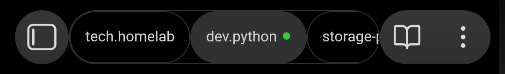

# Mobile Tab Bar

Browser-style tab bar for switching between open notes on Obsidian mobile. Replaces the title bar with a scrollable row of tabs.



## Features

- Scrollable tab bar when many notes are open
- Tap to switch between open notes
- Long-press to close a tab
- Active tab auto-scrolls into view
- Save indicator dot (green = saved, red = pending), requires [autosave-control](https://github.com/slateblu3/obsidian-autosave-control) plugin (optional)
- Mobile only, does not activate on desktop

## Dependencies

- **autosave-control** (optional): if installed, a colored dot appears next to the active tab name showing save state. Without it, the dot is hidden. The plugin reads `autosave-control`'s `.save-status-icon` DOM element, so it may break if that plugin changes its class names.

## Install

### Community plugins (recommended)

Search "Mobile Tab Bar" in Settings > Community plugins > Browse.

### Manual

Download `main.js`, `styles.css`, `manifest.json` from [Releases](https://github.com/nnyj/obsidian-mobile-tab-bar/releases) into `.obsidian/plugins/mobile-tab-bar/`.

## Build

```bash
npm install
npm run build
```

Output is `main.js` at repo root. Copy `main.js`, `styles.css`, `manifest.json` into your vault at `.obsidian/plugins/mobile-tab-bar/` and reload Obsidian.

For development with auto-rebuild: `npm run dev`

## Customization

Override CSS variables in a snippet:

```css
.mtb-tab-bar {
  background: var(--background-secondary);
  border-radius: 8px;
}
.mtb-tab {
  font-size: 11px;
  padding: 0 8px;
}
```
